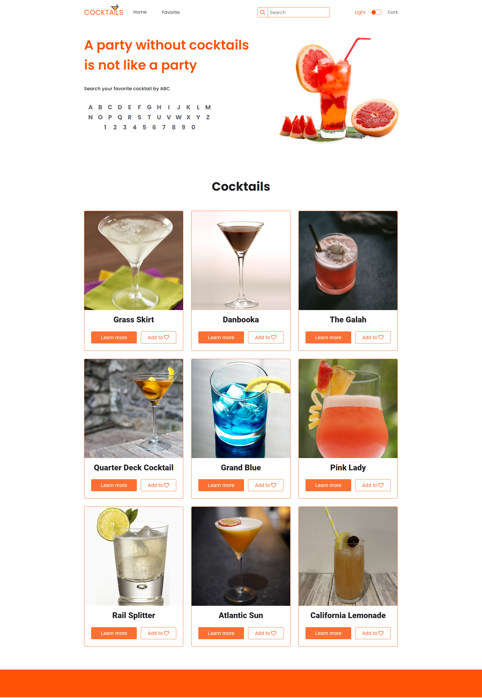

# Cocktail Bar Web application

Welcome to the Cocktail Bar! This project is a web application that allows users to search and
browse through a variety of cocktail recipes, view detailed information about different cocktails,
and explore various drink categories. Users can filter cocktails by name and add their favorite
recipes to a list.



## Features

- **Search Functionality**: Search for cocktails by name using an alphabetic search bar.
- **Filter Options**: Filter cocktails based on various criteria.
- **Favorite Cocktails**: Add cocktails to list of favorites for quick access.
- **Responsive Design**: The web app is fully responsive and works well on all devices.
- **Light/Dark Mode**: Toggle between light and dark themes.

## Technologies Used

- **HTML5**: For the structure of the web pages.
- **CSS3**: For styling the web pages.
- **JavaScript**: For the functionality of the web app.
- **API Integration**: Fetching cocktail data from a public API.

## Project Setup

1. **Clone the repository**:

   ```
   git clone https://github.com/yourusername/cocktail-bar-site.git
   cd cocktail-bar-site
   ```

2. **Install dependencies**:

```
npm install
```

3. **Run the application**:

```
npm start
```

4. **Build the application for production**:

```
npm run build
```

## Contributions

Contributions are welcome! If you would like to contribute to this project, please follow these
steps:

1. Fork the repository.
2. Create a new branch: `git checkout -b my-feature-branch`.
3. Make your changes and commit them: `git commit -m 'Add some feature'`.
4. Push to the branch: `git push origin my-feature-branch`.
5. Create a pull request.

## Acknowledgements

Thanks to the creators of the APIs used in this project. Special thanks to the team members who
contributed to the development of this site.
